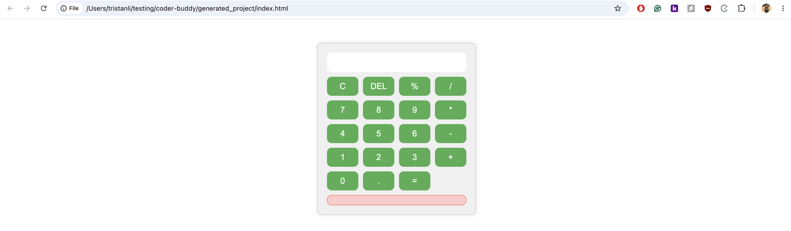

# One Shot Project Builder

**One Shot Project Builder** is an AI-powered coding assistant built with [LangGraph]
Functions like a multi-agent development team that can take a users input request and transform it into a complete, working project — file by file — using real developer workflows.

---

## Architecture

- **Planner Agent** – Analyzes your request and generates a detailed project plan.
- **Architect Agent** – Breaks down the plan into specific engineering tasks with explicit context for each file.
- **Coder Agent** – Implements each task, writes directly into files, and uses available tools like a real developer.

<div style="text-align: center;">
    
</div>

---

## Prereqs
- Make sure you have uv installed, follow the instructions [here](https://docs.astral.sh/uv/getting-started/installation/) to install it.
- Make sure that you have a Groq API key ready. You can create an API key at https://console.groq.com/home

### **Instsllstion**
- Create a virtual environment using: `uv venv` and activate it using `source .venv/bin/activate`
- Install the dependencies using: `uv pip install -r pyproject.toml`
- Create a `.env` file and add `GROQ_API_KEY` with your Groq API key

Run the application using the following command:
  ```bash
    python main.py or uv run python main.py
  ```

### Example Prompt + Project Attached
Build a polished calculator using HTML, CSS, and vanilla JavaScript. It should support basic arithmetic, decimals, keyboard input, and clean error handling.


### Some Notes
- Possibly add an additional agent node at the start to figure out how complex user request will be. Ex: less complex -> use a model with lower token limits, more complex -> use a model with higher token limits
- Cut down on tokens (Note: more specific prompts -> less tokens, but too specific removes need for planning and architect agents)
- Create better prompts?
- Find best model
- README for generated projects? -> specific project root/name

 
 
